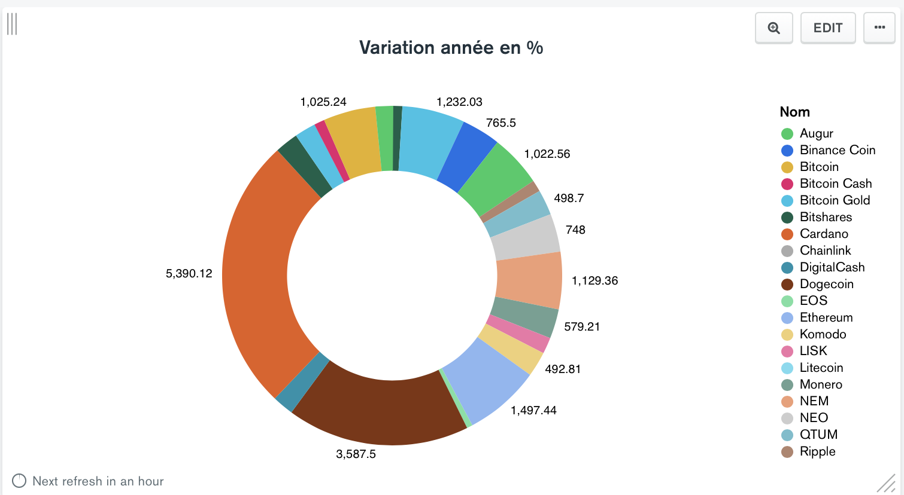
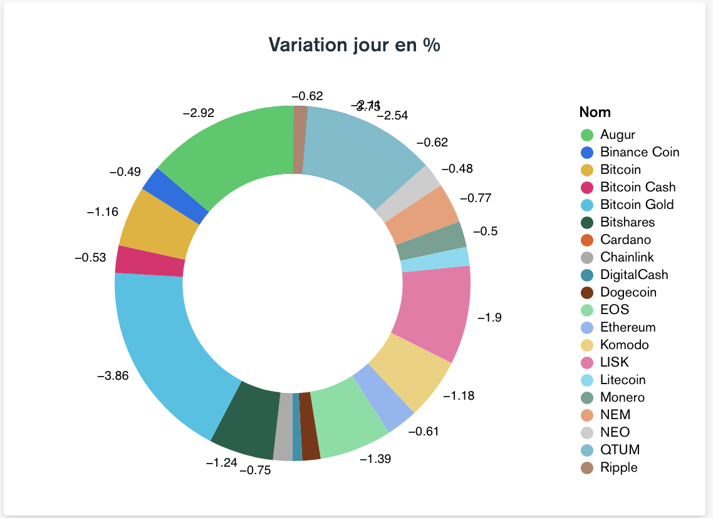
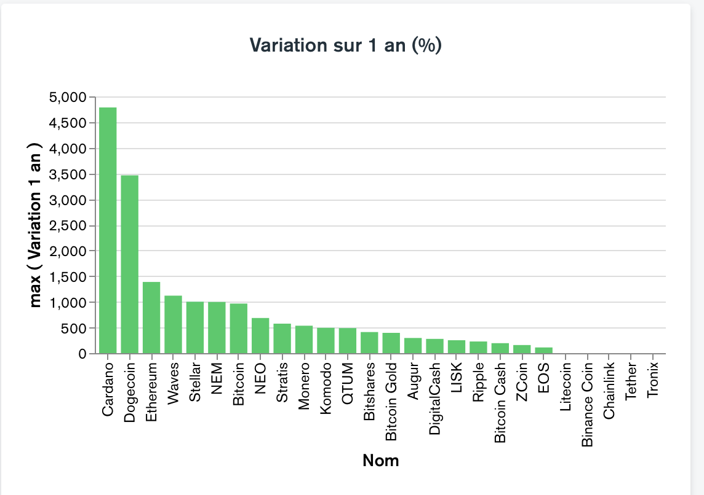
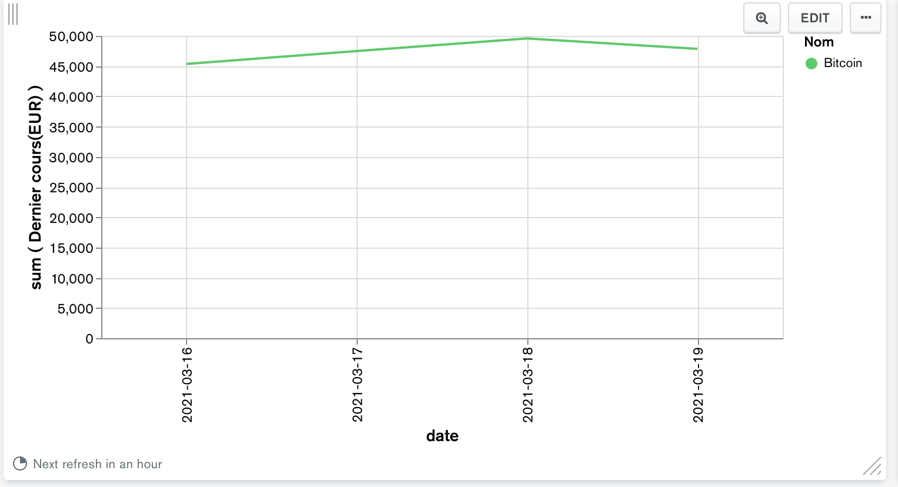

# Analyse financière sur la toile

## Contexte du projet
Le CRKI vous propose une nouvelle mission. Est-il possible de faire de l'analyse financière à partir des technologies maîtrisées par l'équipe de dev ? Pour cela vous devez constituer un dataset financier à partir de données trouvées sur le web, puis les stocker en base. Cette base doit vous permettre de faire de la dataviz. A vous de faire les choix techniques pour rendre le projet réalisable.


### Page web 
[ABC Bourse](https://www.abcbourse.com/marches/cryptomonnaies)

### Code scraping

```python
from bs4 import BeautifulSoup
import requests
from data import Data
from bson.objectid import ObjectId
from datetime import date

today = date.today()


drive = requests.get("https://www.abcbourse.com/marches/cryptomonnaies")
print(drive)

if drive.ok:
    soup = BeautifulSoup(drive.text, "lxml")
    all_td = soup.find_all('tr', {"class": "alri"})
    for i in all_td:
        d = {}
        i_split = i.text.split("\n")
        d["_id"] = ObjectId()
        d["date"] = str(today)
        d["Nom"] = i_split[1]
        d["Dernier cours(USD)"] = float(i_split[2].replace(",","."))
        d["Dernier cours(EUR)"] = float(i_split[3].replace(",","."))
        d["Variation jour"] = float(i_split[4].replace(",",".").replace("%",""))
        d["Variation 1 an"] = float(i_split[5].replace(",",".").replace("%",""))

        print(d)
        Data.insert(d)
```

### Chart








### Choix techniques

nous avons choisi d'utiliser pour le scraping la librairie BeautifulSoup car le site n'etait pas complexe, nous retournons la data sous forme de dictonnaire. <br>
De ce fait nous utilisons MongoDB pour le stockage et Mongo Charts pour les graphiques

[KISS](https://fr.wikipedia.org/wiki/Principe_KISS)
